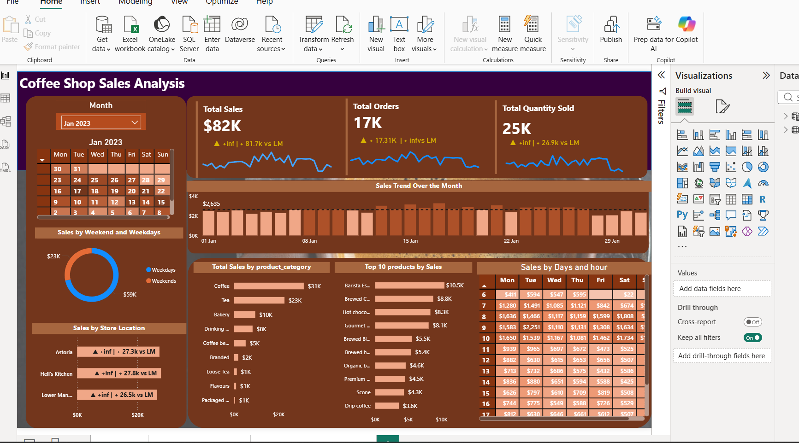

# Data Analytics & BI Solutions
**Focusing on high-impact BI dashboards, advanced SQL data modeling, and scalable machine learning solutions**.

---

## 01. Projects

### Automobile Price Prediction | [Code](https://github.com/rahul-120805/Machine-learning-college-/blob/main/Car%20Price%20Prediction%20Machine%20Learning%20Project.ipynb) 
A machine learning solution to predict vehicle market values using regression analysis.
- **Key Feature:** Performed Data Cleaning, Label Encoding, Exploratory Data Analysis and Feature Selection then used Regression Models to predict car prices
- **Tools:** Python, Jupyter Notebook.
- **Models:** Linear Regression, Random Forest, Gradient Boosting, Decision Tree.
- **Libraries:** Pandas, Numpy, Scikit-Learn

### Nifty 50 Dashboard  
Developed an Interactive Power BI Dashboard for Nifty 50 Stocks with *dynamic* company selection, multiple time filters and candlestick based price analysis, data was imported using python script of yahoo finance. The Dashboard provides quick insights into stock performance and market trends.
- **Key Features** All visuals update dynamically based on selected stock and time period for seamless exploration.
- **Tools:** Power BI, DAX, MS SQL Server(SSMS).
- **Dashboard Previe:w**
  
- **Dashboard Link:**[View Dashboard](https://app.powerbi.com/links/EWCLe-GxSK?ctid=d1f14348-f1b5-4a09-ac99-7ebf213cbc81&pbi_source=linkShare&bookmarkGuid=acb04753-85c8-4f1a-94ec-dd170f9598e0)

### IPL Performance Dashboard 
Built an interactive Power BI dashboard to analyze IPL data, showcasing player performance, match outcomes, venue trends, and season-wise tournament insights using dynamic filters and KPI visuals.
- **Key Features:** Made complex DAX measures to calculate strike rates and economy under varying match conditions.
- **Tools:** Power BI,MS SQL Server(SSMS), Excel.
- **Dashboard Preview**

- **Dashboard Link:**[View Dashboard](https://app.powerbi.com/links/gPPxxyEuKD?ctid=d1f14348-f1b5-4a09-ac99-7ebf213cbc81&pbi_source=linkShare)

### Coffee Sales Analysis Dashboard
Developed an interactive Power BI dashboard to analyze coffee sales performance across products, regions, and time periods. The dashboard highlights key metrics such as total sales, revenue trends, and top-performing products. Dynamic filters enable quick exploration of sales patterns and customer demand. Insights support data-driven decisions to improve sales.
- **Key Features:** Made complex DAX measures, tooltips for more interactive and a dynamic dashboard
-  **Tools:** Power BI,MS SQL Server(SSMS)
-  **Dashboard Preview**

- **Dashboard Link:**[View Dashboard](https://app.powerbi.com/links/jaipep87NX?ctid=d1f14348-f1b5-4a09-ac99-7ebf213cbc81&pbi_source=linkShare)

### Swiggy Sales Analysis | [Code](https://github.com/rahul-120805/SQL-Projects/blob/main/Swiggy%20Sales%20Project%20-%20Copy.sql)
Designed a star schema data model for Swiggy sales data by separating dates into a date dimension, organizing categorical attributes into individual dimension tables, and creating a centralized fact table for transactional sales records. This structure improves data consistency, query performance, and usability for analytical reporting and BI dashboards
- **Key Features:** Checked NULL values across all key dimensions and measures,Detected duplicate records using GROUP BY and HAVING clausesRemoved duplicates using CTEs and window functions (ROW_NUMBER)
- **Tools:** MS SQL Server (SSMS)

### Lok Sabha Election Analysis | [Code](https://github.com/rahul-120805/SQL-Projects/blob/main/Lok%20Sabha%20Election%20Analysis%20-%20Copy.sql)
Performed an in depth SQL based analysis of Lok Sabha election results to study party wise and alliance wise seat distributions across India. The project focuses on deriving insights for major political alliances by aggregating results without altering the base data structure, ensuring accurate and reproducible analysis.
- **Key Features:** Analyzed party-wise and state-wise election outcomes,Used advanced SQL techniques such as CASE statements and aggregate functions to derive insights without modifying source tables
- **Tools:** MS SQL Server (SSMS)

---
## 02. Research Publications

### Impact of Climate Change on Agriculture
Research published in **Springer (2025)** analyzing 23 years of climate data in Maharashtra.
- **Key Feature:** Built predictive models to identify critical climate variables affecting crop productivity.
- **Stack:** Python, ML Regression, Statistical Modeling.

---

## 03. Technical Toolkit

- **Languages:** SQL (MySQL,SSMS), Python, DAX, M Query
- **BI & Analytics:** Power BI, Excel.
- **Databases & Big Data:** MySQL, MongoDB, Hadoop
- **Certifications:**
  - Microsoft Certified: Power BI Data Analyst Associate (PL-300) Nov'25
  - Microsoft Certified: Azure Data Fundamentals (DP-900) — *Pursuing*

---

## 03. Education & Leadership

**NMIMS University, Navi Mumbai** *B.Sc. Data Science | Expected May 2026* - **GPA:** 3.4 / 4.0 (As of 5th Semester)  
- **Role:** Senior Placement Committee Member (Managing recruiter relations and placement activities).
